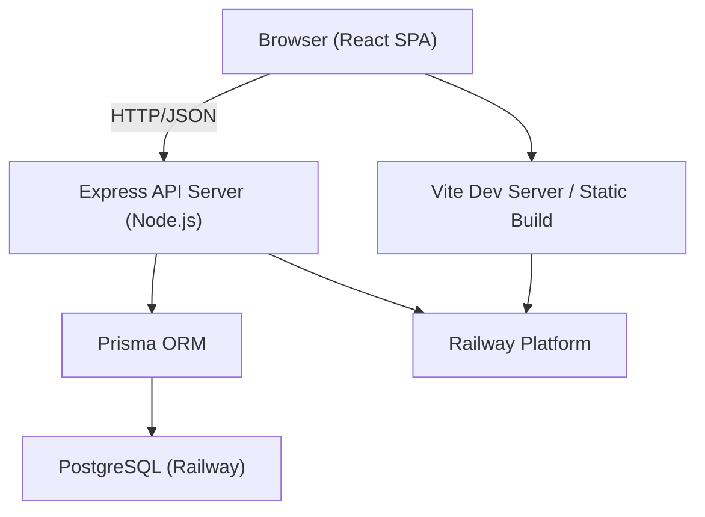
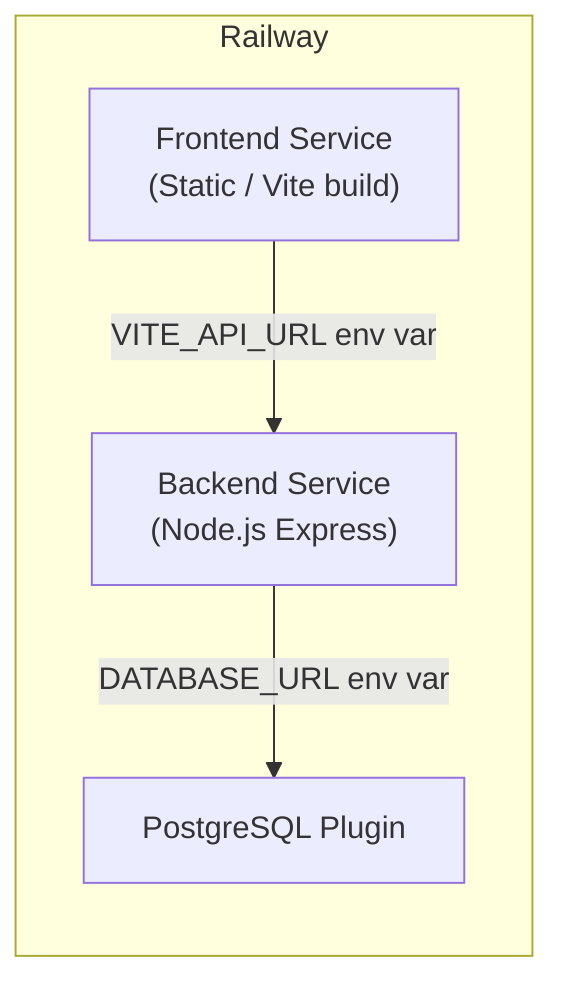
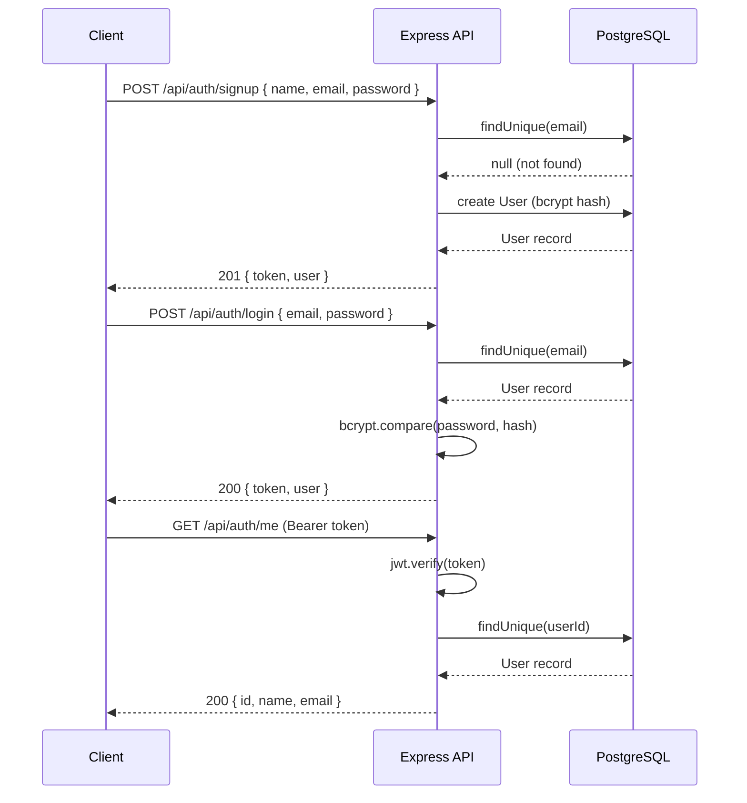
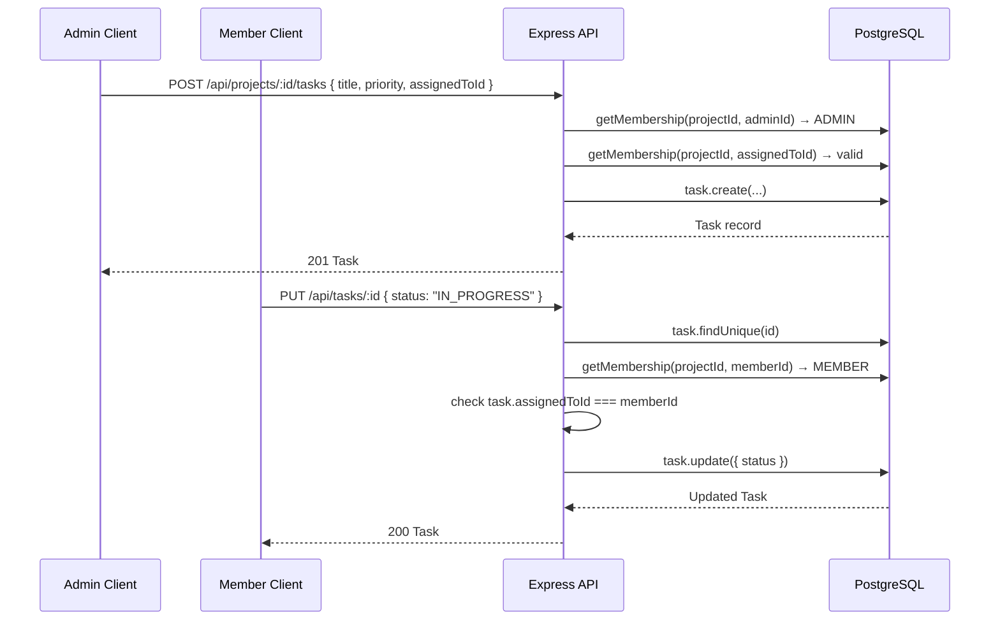
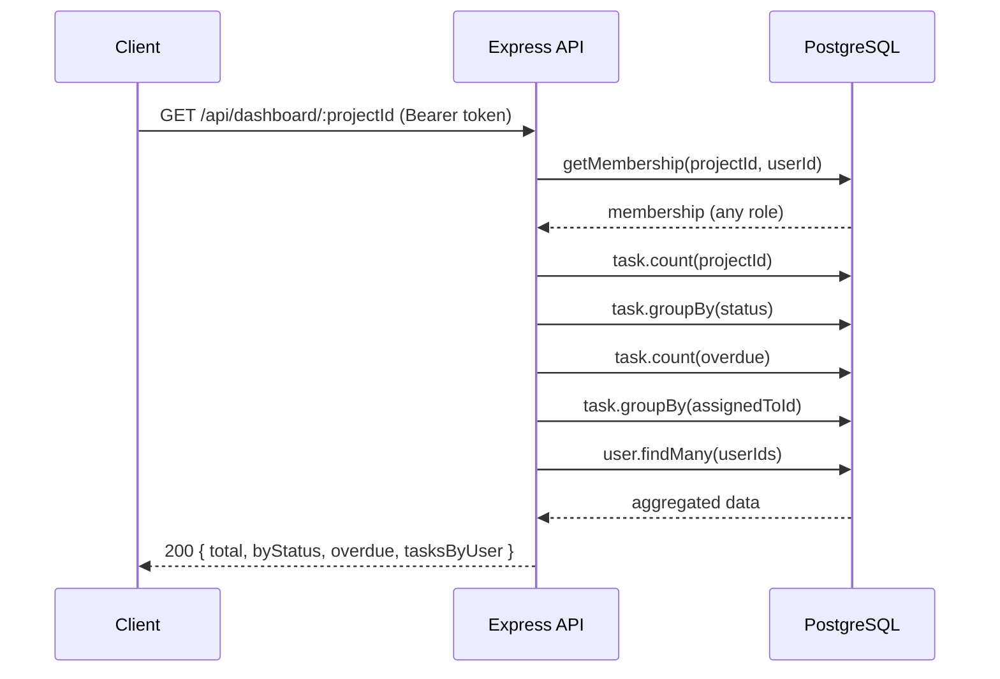
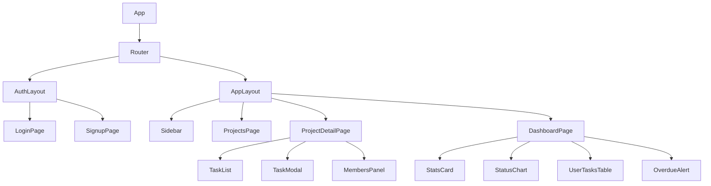

# Design Document: Team Task Management Web Application

## Overview

A full-stack web application that enables teams to collaboratively manage projects and tasks. Users authenticate via JWT, create or join projects with role-based access (Admin / Member), and manage tasks through a RESTful API backed by PostgreSQL via Prisma ORM. The frontend is a React + TypeScript SPA built with Vite and styled with Tailwind CSS, deployed on Railway.

The backend is already scaffolded (Express, Prisma, JWT auth, all four route groups). The frontend is a bare Vite + TypeScript scaffold that needs to be converted into a full React SPA. This design covers the complete system — both what exists and what must be built.

---

## Architecture



### Deployment Topology (Railway)



---

## Sequence Diagrams

### User Authentication Flow



### Task Lifecycle Flow



### Dashboard Data Flow



---

## Components and Interfaces

### Backend Components

#### Auth Router (`/api/auth`)

**Purpose**: Handle user registration, login, and identity verification.

**Interface**:
```typescript
POST   /api/auth/signup  → { token: string, user: UserDTO }
POST   /api/auth/login   → { token: string, user: UserDTO }
GET    /api/auth/me      → UserDTO                          // requires Bearer token
```

**Responsibilities**:
- Validate input with express-validator
- Hash passwords with bcryptjs (salt rounds: 10)
- Sign/verify JWTs with `JWT_SECRET` env var (7-day expiry)
- Return consistent error shapes `{ error: string }` or `{ errors: ValidationError[] }`

#### Projects Router (`/api/projects`)

**Purpose**: CRUD for projects and member management.

**Interface**:
```typescript
GET    /api/projects              → Project[]               // member's projects
POST   /api/projects              → Project                 // creates + auto-joins as ADMIN
GET    /api/projects/:id          → ProjectDetail           // includes members & tasks
PUT    /api/projects/:id          → Project                 // ADMIN only
DELETE /api/projects/:id          → { message: string }     // ADMIN only
POST   /api/projects/:id/members  → ProjectMember           // ADMIN only, by email
DELETE /api/projects/:id/members/:userId → { message }      // ADMIN only
```

**Responsibilities**:
- Enforce ADMIN/MEMBER role checks via `requireAdmin` / `requireMember` helpers
- Auto-create `ProjectMember` record with role `ADMIN` on project creation
- Prevent admin self-removal

#### Tasks Router (`/api/projects/:projectId/tasks`, `/api/tasks/:id`)

**Purpose**: Task CRUD with role-based field restrictions.

**Interface**:
```typescript
GET    /api/projects/:projectId/tasks  → Task[]
POST   /api/projects/:projectId/tasks  → Task    // ADMIN only
PUT    /api/tasks/:id                  → Task    // ADMIN: all fields; MEMBER: status only (own tasks)
DELETE /api/tasks/:id                  → { message } // ADMIN only
```

**Responsibilities**:
- Validate status enum: `TODO | IN_PROGRESS | DONE`
- Validate priority enum: `LOW | MEDIUM | HIGH`
- Ensure assignee is a project member before assigning
- Members restricted to updating `status` on tasks assigned to them

#### Dashboard Router (`/api/dashboard`)

**Purpose**: Aggregate task statistics per project.

**Interface**:
```typescript
GET /api/dashboard/:projectId → DashboardDTO
```

**Responsibilities**:
- Run four parallel Prisma queries (count, groupBy×2, count overdue)
- Enrich `tasksByUser` with user name/email
- Accessible to any project member

#### Auth Middleware

**Purpose**: Protect routes by verifying JWT Bearer tokens.

```typescript
function auth(req: Request, res: Response, next: NextFunction): void
// Sets req.userId from decoded JWT payload
// Returns 401 if token missing or invalid
```

---

### Frontend Components

The frontend is a React + TypeScript SPA. The existing `src/main.ts` will be replaced with a React entry point.

#### Component Tree



#### Key Frontend Interfaces

```typescript
// Auth context
interface AuthContextValue {
  user: UserDTO | null
  token: string | null
  login(email: string, password: string): Promise<void>
  signup(name: string, email: string, password: string): Promise<void>
  logout(): void
}

// API response shapes
interface UserDTO {
  id: string
  name: string
  email: string
}

interface Project {
  id: string
  name: string
  description?: string
  adminId: string
  admin: UserDTO
  role: 'ADMIN' | 'MEMBER'
  _count: { members: number; tasks: number }
  createdAt: string
}

interface Task {
  id: string
  title: string
  description?: string
  status: 'TODO' | 'IN_PROGRESS' | 'DONE'
  priority: 'LOW' | 'MEDIUM' | 'HIGH'
  dueDate?: string
  projectId: string
  assignedTo?: UserDTO
  createdAt: string
}

interface DashboardDTO {
  total: number
  byStatus: { status: string; count: number }[]
  overdue: number
  tasksByUser: { user: UserDTO; count: number }[]
}
```

---

## Data Models

### Prisma Schema (existing — no changes needed)

```prisma
model User {
  id        String   @id @default(uuid())
  name      String
  email     String   @unique
  password  String
  createdAt DateTime @default(now())

  createdProjects Project[]       @relation("ProjectAdmin")
  memberships     ProjectMember[]
  tasks           Task[]
}

model Project {
  id          String   @id @default(uuid())
  name        String
  description String?
  createdAt   DateTime @default(now())
  adminId     String
  admin       User     @relation("ProjectAdmin", fields: [adminId], references: [id], onDelete: Cascade)
  members     ProjectMember[]
  tasks       Task[]
}

model ProjectMember {
  id        String   @id @default(uuid())
  role      String   @default("MEMBER")   // "ADMIN" | "MEMBER"
  joinedAt  DateTime @default(now())
  userId    String
  user      User     @relation(fields: [userId], references: [id], onDelete: Cascade)
  projectId String
  project   Project  @relation(fields: [projectId], references: [id], onDelete: Cascade)
  @@unique([userId, projectId])
}

model Task {
  id           String    @id @default(uuid())
  title        String
  description  String?
  status       String    @default("TODO")    // "TODO" | "IN_PROGRESS" | "DONE"
  priority     String    @default("MEDIUM")  // "LOW" | "MEDIUM" | "HIGH"
  dueDate      DateTime?
  createdAt    DateTime  @default(now())
  projectId    String
  project      Project   @relation(fields: [projectId], references: [id], onDelete: Cascade)
  assignedToId String?
  assignedTo   User?     @relation(fields: [assignedToId], references: [id], onDelete: SetNull)
}
```

**Validation Rules**:
- `User.email` must be unique; validated as email format
- `User.password` minimum 6 characters (stored as bcrypt hash)
- `Task.status` must be one of `TODO`, `IN_PROGRESS`, `DONE`
- `Task.priority` must be one of `LOW`, `MEDIUM`, `HIGH`
- `Task.assignedToId` must reference a user who is a member of the same project
- `ProjectMember` has a composite unique constraint `[userId, projectId]`

---

## Algorithmic Pseudocode

### Authentication: signup

```pascal
PROCEDURE signup(name, email, password)
  INPUT: name: String, email: String, password: String
  OUTPUT: { token: String, user: UserDTO } | ErrorResponse

  PRECONDITIONS:
    name is non-empty string
    email matches RFC 5322 format
    password.length >= 6

  SEQUENCE
    errors ← validateInput(name, email, password)
    IF errors NOT EMPTY THEN
      RETURN 400 { errors }
    END IF

    existing ← db.user.findUnique(WHERE email = email)
    IF existing IS NOT NULL THEN
      RETURN 400 { error: "Email already in use" }
    END IF

    hash ← bcrypt.hash(password, saltRounds=10)
    user ← db.user.create({ name, email, password: hash })
    token ← jwt.sign({ userId: user.id }, JWT_SECRET, expiresIn="7d")

    RETURN 201 { token, user: { id, name, email } }
  END SEQUENCE

  POSTCONDITIONS:
    user record exists in DB with hashed password
    returned token decodes to { userId: user.id }
END PROCEDURE
```

### Authorization: requireAdmin

```pascal
PROCEDURE requireAdmin(projectId, userId)
  INPUT: projectId: UUID, userId: UUID
  OUTPUT: boolean

  SEQUENCE
    member ← db.projectMember.findUnique(
      WHERE userId = userId AND projectId = projectId
    )
    IF member IS NULL OR member.role != "ADMIN" THEN
      RETURN false
    END IF
    RETURN true
  END SEQUENCE

  POSTCONDITIONS:
    true iff user has ADMIN role in the given project
END PROCEDURE
```

### Task Update: role-based field restriction

```pascal
PROCEDURE updateTask(taskId, userId, updatePayload)
  INPUT: taskId: UUID, userId: UUID, updatePayload: Object
  OUTPUT: Task | ErrorResponse

  SEQUENCE
    task ← db.task.findUnique(WHERE id = taskId)
    IF task IS NULL THEN RETURN 404 { error: "Task not found" } END IF

    membership ← db.projectMember.findUnique(
      WHERE userId = userId AND projectId = task.projectId
    )
    IF membership IS NULL THEN RETURN 403 { error: "Not a member" } END IF

    IF membership.role = "MEMBER" THEN
      IF task.assignedToId != userId THEN
        RETURN 403 { error: "You can only update tasks assigned to you" }
      END IF
      // Members may only change status
      updated ← db.task.update(WHERE id = taskId, DATA { status: updatePayload.status })
      RETURN 200 updated
    END IF

    // ADMIN path: validate assignee membership if changing assignee
    IF updatePayload.assignedToId IS NOT NULL THEN
      assigneeMembership ← db.projectMember.findUnique(
        WHERE userId = updatePayload.assignedToId AND projectId = task.projectId
      )
      IF assigneeMembership IS NULL THEN
        RETURN 400 { error: "Assignee is not a project member" }
      END IF
    END IF

    updated ← db.task.update(WHERE id = taskId, DATA updatePayload)
    RETURN 200 updated
  END SEQUENCE

  POSTCONDITIONS:
    MEMBER: only status field mutated, only on own tasks
    ADMIN: any field may be mutated; assignee must be a project member
END PROCEDURE
```

### Dashboard Aggregation

```pascal
PROCEDURE getDashboard(projectId, userId)
  INPUT: projectId: UUID, userId: UUID
  OUTPUT: DashboardDTO | ErrorResponse

  PRECONDITIONS:
    userId is a member of projectId

  SEQUENCE
    membership ← db.projectMember.findUnique(WHERE userId AND projectId)
    IF membership IS NULL THEN RETURN 403 END IF

    now ← currentTimestamp()

    // Run four queries in parallel
    [total, byStatus, overdue, tasksByUser] ← PARALLEL
      db.task.count(WHERE projectId = projectId)
      db.task.groupBy(BY status, WHERE projectId = projectId, COUNT status)
      db.task.count(WHERE projectId = projectId AND dueDate < now AND status != "DONE")
      db.task.groupBy(BY assignedToId, WHERE projectId AND assignedToId != null, COUNT assignedToId)
    END PARALLEL

    userIds ← tasksByUser.map(t → t.assignedToId)
    users ← db.user.findMany(WHERE id IN userIds, SELECT { id, name, email })
    userMap ← Map(users, key=id)

    enriched ← tasksByUser.map(t → { user: userMap[t.assignedToId], count: t.count })

    RETURN 200 { total, byStatus, overdue, tasksByUser: enriched }
  END SEQUENCE

  POSTCONDITIONS:
    total >= 0
    sum(byStatus[*].count) = total
    overdue <= total
    tasksByUser[*].user is a valid project member
END PROCEDURE
```

### Frontend: API Client

```pascal
PROCEDURE apiRequest(method, path, body?, token?)
  INPUT: method: "GET"|"POST"|"PUT"|"DELETE", path: String,
         body?: Object, token?: String
  OUTPUT: ResponseData | throws ApiError

  SEQUENCE
    headers ← { "Content-Type": "application/json" }
    IF token IS NOT NULL THEN
      headers["Authorization"] ← "Bearer " + token
    END IF

    response ← fetch(VITE_API_URL + path, { method, headers, body: JSON.stringify(body) })

    IF response.status = 401 THEN
      clearAuthToken()
      redirect("/login")
      THROW AuthError("Session expired")
    END IF

    data ← response.json()

    IF NOT response.ok THEN
      THROW ApiError(data.error OR "Request failed", response.status)
    END IF

    RETURN data
  END SEQUENCE
END PROCEDURE
```

---

## Key Functions with Formal Specifications

### `auth` middleware

```javascript
function auth(req, res, next)
```

**Preconditions:**
- `req.headers.authorization` may or may not be present

**Postconditions:**
- If valid Bearer token: `req.userId` is set to the decoded `userId`, `next()` is called
- If missing or invalid token: responds `401 { error }`, `next()` is NOT called

**Loop Invariants:** N/A

---

### `requireAdmin(projectId, userId, res)`

```javascript
async function requireAdmin(projectId, userId, res): Promise<boolean>
```

**Preconditions:**
- `projectId` and `userId` are valid UUIDs

**Postconditions:**
- Returns `true` iff a `ProjectMember` record exists with matching IDs and `role === 'ADMIN'`
- Returns `false` and sends `403` response otherwise

---

### `getMembership(projectId, userId)`

```javascript
async function getMembership(projectId, userId): Promise<ProjectMember | null>
```

**Preconditions:**
- Both IDs are non-null strings

**Postconditions:**
- Returns the `ProjectMember` record or `null`
- No side effects

---

### `getDashboard(projectId)` — route handler

```javascript
router.get('/:projectId', auth, async (req, res))
```

**Preconditions:**
- `req.userId` set by auth middleware
- `req.params.projectId` is a valid project UUID

**Postconditions:**
- Returns `DashboardDTO` with `total`, `byStatus[]`, `overdue`, `tasksByUser[]`
- All four DB queries run in parallel via `Promise.all`
- `tasksByUser` entries are enriched with full user objects

---

## Example Usage

### Signup and create a project

```typescript
// 1. Sign up
const { token, user } = await api.post('/auth/signup', {
  name: 'Alice',
  email: 'alice@example.com',
  password: 'secret123',
})

// 2. Create a project (auto-joined as ADMIN)
const project = await api.post('/projects', { name: 'Q3 Launch' }, token)
// project.role === 'ADMIN'

// 3. Add a member by email
await api.post(`/projects/${project.id}/members`, { email: 'bob@example.com' }, token)

// 4. Create a task assigned to Bob
const task = await api.post(`/projects/${project.id}/tasks`, {
  title: 'Write landing page copy',
  priority: 'HIGH',
  dueDate: '2025-09-01',
  assignedToId: bobUserId,
}, token)
```

### Member updates task status

```typescript
// Bob (MEMBER) can only update status on his own tasks
await api.put(`/tasks/${task.id}`, { status: 'IN_PROGRESS' }, bobToken)

// Bob cannot update title — backend silently ignores non-status fields for members
// Bob cannot update tasks not assigned to him → 403
```

### Fetch dashboard

```typescript
const dashboard = await api.get(`/dashboard/${project.id}`, token)
// {
//   total: 5,
//   byStatus: [{ status: 'TODO', count: 3 }, { status: 'IN_PROGRESS', count: 2 }],
//   overdue: 1,
//   tasksByUser: [{ user: { id, name, email }, count: 3 }]
// }
```

---

## Correctness Properties

### Authentication

- For all signup requests: if `email` already exists in DB → response is `400`
- For all login requests: if `bcrypt.compare(password, hash)` is `false` → response is `400`
- For all protected routes: if JWT is missing or invalid → response is `401`
- JWT payload always contains `{ userId }` matching the authenticated user's DB id

### Authorization

- For all project-mutating operations (PUT/DELETE project, add/remove member, create/delete task): if `membership.role !== 'ADMIN'` → response is `403`
- For all task status updates by a MEMBER: if `task.assignedToId !== req.userId` → response is `403`
- A user can only see projects where a `ProjectMember` record exists for their `userId`

### Data Integrity

- For all task creation: if `assignedToId` is provided and no `ProjectMember` record exists for that user in the project → response is `400`
- Project creation always creates a corresponding `ProjectMember` record with `role = 'ADMIN'` in the same transaction
- Deleting a project cascades to delete all its `ProjectMember` and `Task` records
- Deleting a user sets `Task.assignedToId` to `null` (SetNull) rather than deleting tasks

### Dashboard

- `total` equals the sum of all `byStatus[*].count` values
- `overdue` count only includes tasks where `dueDate < now` AND `status !== 'DONE'`
- `tasksByUser` only includes tasks with a non-null `assignedToId`

---

## Error Handling

### Scenario 1: Duplicate Email on Signup

**Condition**: `POST /api/auth/signup` with an email already in the database  
**Response**: `400 { error: "Email already in use" }`  
**Recovery**: Client displays the error message; user corrects email

### Scenario 2: Invalid JWT

**Condition**: Any protected route called with expired or malformed token  
**Response**: `401 { error: "Invalid token" }`  
**Recovery**: Frontend clears stored token and redirects to `/login`

### Scenario 3: Non-member Access

**Condition**: User requests a project or task they are not a member of  
**Response**: `403 { error: "Not a member of this project" }`  
**Recovery**: Frontend shows access denied message

### Scenario 4: Member Attempts Admin Action

**Condition**: MEMBER tries to create/delete a task or add a member  
**Response**: `403 { error: "Admin access required" }`  
**Recovery**: Frontend hides admin-only UI elements based on `role`

### Scenario 5: Assignee Not a Project Member

**Condition**: Admin tries to assign a task to a user not in the project  
**Response**: `400 { error: "Assignee is not a project member" }`  
**Recovery**: Frontend only shows project members in the assignee dropdown

### Scenario 6: Validation Errors

**Condition**: Required fields missing or invalid format  
**Response**: `400 { errors: [{ msg, path }] }` (express-validator format)  
**Recovery**: Frontend maps errors to form field messages

### Scenario 7: Database / Server Error

**Condition**: Unexpected Prisma or runtime error  
**Response**: `500 { error: "Server error" }`  
**Recovery**: Frontend shows generic error toast; logs error server-side

---

## Testing Strategy

### Unit Testing Approach

Test individual route handlers and middleware in isolation using mocked Prisma client.

Key test cases:
- `auth` middleware: valid token sets `req.userId`; missing token returns 401; expired token returns 401
- `requireAdmin`: returns true for ADMIN, false + 403 for MEMBER or non-member
- `signup`: duplicate email returns 400; valid input creates user and returns token
- `login`: wrong password returns 400; correct credentials return token
- `updateTask`: MEMBER can only update status on own tasks; ADMIN can update all fields

### Property-Based Testing Approach

**Property Test Library**: `fast-check` (already installed in `backend/node_modules`)

Properties to test:
- For any valid `{ name, email, password }` where email is unique → signup always returns a JWT decodable to `{ userId }`
- For any task update by a MEMBER where `assignedToId !== userId` → response is always 403
- For any dashboard query → `total` always equals `sum(byStatus[*].count)`
- For any set of tasks with `dueDate` values → `overdue` count equals tasks where `dueDate < now && status !== 'DONE'`

### Integration Testing Approach

End-to-end tests against a test PostgreSQL database:
- Full auth flow: signup → login → `/me`
- Project lifecycle: create → add member → list projects (both users see it)
- Task lifecycle: create (admin) → update status (member) → delete (admin)
- Dashboard: create tasks in various states → verify aggregation correctness
- RBAC enforcement: member attempts admin actions → all return 403

---

## Performance Considerations

- Dashboard uses `Promise.all` to run four DB queries in parallel, minimizing latency
- Prisma queries use `select` to return only needed fields (avoids over-fetching passwords)
- JWT verification is synchronous and in-memory — no DB hit per request
- Frontend should debounce task status updates to avoid rapid successive API calls
- For large projects, task lists should support pagination (future: add `skip`/`take` query params)

---

## Security Considerations

- Passwords stored as bcrypt hashes (cost factor 10) — never returned in API responses
- JWT signed with `JWT_SECRET` env var — must be a strong random secret in production
- CORS configured to allow only `FRONTEND_URL` origin in production
- All routes (except `/api/auth/signup`, `/api/auth/login`, `/health`) require valid JWT
- Role checks performed server-side on every mutating request — frontend role state is UI-only
- `express-validator` sanitizes and validates all user inputs before DB operations
- Prisma parameterized queries prevent SQL injection
- Admin cannot remove themselves from a project (prevents accidental lockout)
- `assignedToId` validated as a project member before task creation/update

---

## Dependencies

### Backend (existing)

| Package | Version | Purpose |
|---|---|---|
| express | ^5.2.1 | HTTP server framework |
| @prisma/client | ^7.8.0 | Type-safe DB client |
| bcryptjs | ^3.0.3 | Password hashing |
| jsonwebtoken | ^9.0.3 | JWT sign/verify |
| express-validator | ^7.3.2 | Input validation |
| cors | ^2.8.6 | Cross-origin requests |
| dotenv | ^17.4.2 | Environment variables |

### Frontend (to be added)

| Package | Purpose |
|---|---|
| react + react-dom | UI framework |
| @types/react + @types/react-dom | TypeScript types |
| react-router-dom (already installed) | Client-side routing |
| axios (already installed) | HTTP client |
| tailwindcss (already installed) | Utility CSS |
| lucide-react (already installed) | Icon library |
| react-hot-toast (already installed) | Toast notifications |

### Infrastructure

| Service | Purpose |
|---|---|
| Railway (Backend service) | Node.js Express API hosting |
| Railway (Frontend service) | Static site hosting (Vite build) |
| Railway (PostgreSQL plugin) | Managed PostgreSQL database |
